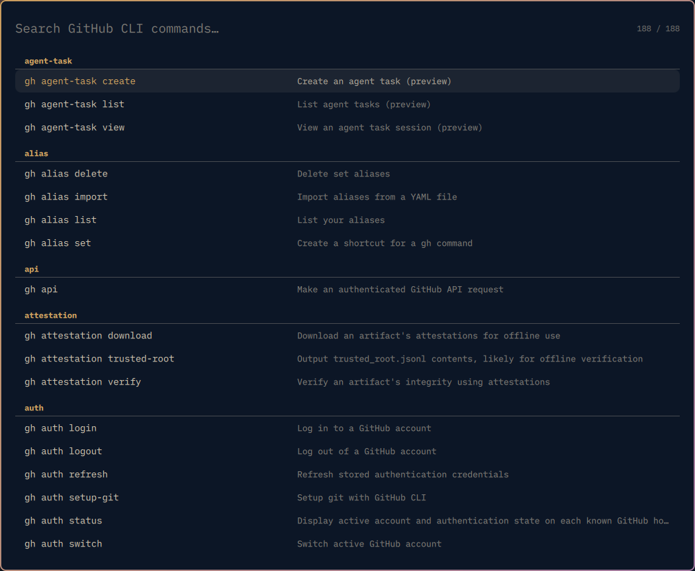

# GitHub CLI Cheatsheet for Omarchy

A searchable pop-up of every [GitHub CLI](https://cli.github.com/) (`gh`) command, grouped the way the [gh manual](https://cli.github.com/manual/)'s table of contents is: one section per command, from `agent-task` to `workflow`, with its subcommands underneath. Pick a command and it is typed into the focused window, ready for you to add arguments. It never runs the command for you.

It works like Omarchy's `SUPER + K` keybindings window and follows your Omarchy theme.



## How it works

- The command list is generated from your installed `gh` (`gh --help` and `gh <command> --help`), so it always matches your version. Your own aliases and installed extensions are left out, since the manual does not list them.
- The list is cached in `~/.cache/io.github.bkbatchelor.omarchy-github-cli-cheatsheet/` and rebuilt automatically when `gh` is upgraded.
- The chosen command is inserted with a trailing space (for example `gh pr create `) by pasting it with Shift+Insert. Enter is never pressed.

## Install

```bash
omarchy plugin add https://github.com/bkbatchelor/omarchy-github-cli-cheatsheet.git --enable
```

Then add a keybinding to `~/.config/hypr/bindings.lua`. The plugin does not change your configuration itself.

```lua
o.bind("SUPER + CTRL + G", "GitHub CLI cheatsheet", "omarchy-shell shell toggle io.github.bkbatchelor.omarchy-github-cli-cheatsheet '{}'")
```

Check that the key is free first with `omarchy menu keybindings --print`. You can also open the picker from a script or terminal:

```bash
omarchy-shell shell toggle io.github.bkbatchelor.omarchy-github-cli-cheatsheet '{}'
```

## Usage

| Key | Action |
|---|---|
| Type | Filter by command, description, or category (`pr cre` → `gh pr create`) |
| `↑` / `↓` | Move the selection |
| `Page Up` / `Page Down` | Move a page |
| `Tab` / `Shift + Tab` | Jump to the next or previous category |
| `Enter` or click | Insert the command into the focused window |
| `Backspace` / `Ctrl + U` | Delete a character or clear the search |
| `Esc` | Clear the search, then close |

To rebuild the list by hand (for example after adding a `gh` alias or extension):

```bash
~/.config/omarchy/plugins/io.github.bkbatchelor.omarchy-github-cli-cheatsheet/bin/gh-cheatsheet-index --refresh --print
```

## Requirements

- [Omarchy](https://omarchy.org/) with the Quickshell-based `omarchy-shell`
- [`gh`](https://cli.github.com/) on your `PATH`. `~/.local/bin` and mise shims are also searched.
- `jq`, `wl-clipboard`, and `wtype`, which ship with Omarchy

## Permissions

Omarchy plugins run unsandboxed inside `omarchy-shell`. This plugin only:

- runs `gh --help` and `gh <command> --help`, with no network access or authentication,
- writes its index cache under `~/.cache/io.github.bkbatchelor.omarchy-github-cli-cheatsheet/`,
- places the chosen command on the clipboard briefly and sends Shift+Insert to paste it.

It never uses sudo and never edits your configuration.

## Remove

```bash
omarchy plugin remove io.github.bkbatchelor.omarchy-github-cli-cheatsheet
rm -rf ~/.cache/io.github.bkbatchelor.omarchy-github-cli-cheatsheet
```

Also delete the keybinding line from `~/.config/hypr/bindings.lua` if you added one.

## Development

```bash
omarchy plugin validate .
qmllint -I "$OMARCHY_PATH/shell" Overlay.qml
node tests/search-test.js
tests/index-test.sh
```

## License

[MIT](LICENSE)
